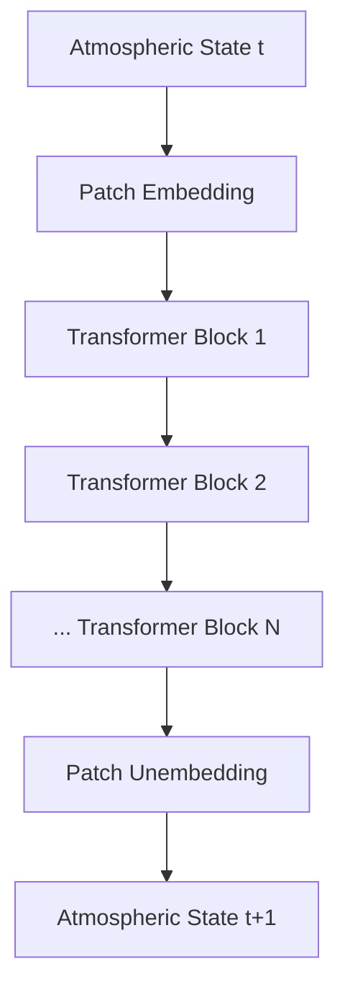
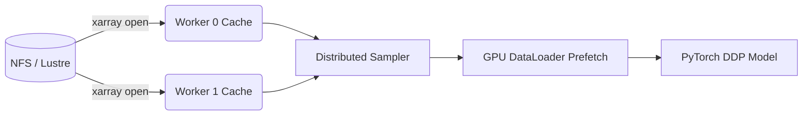
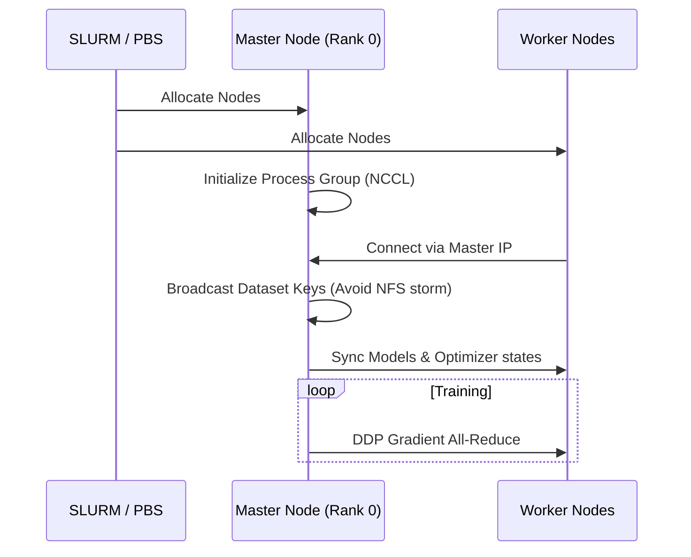
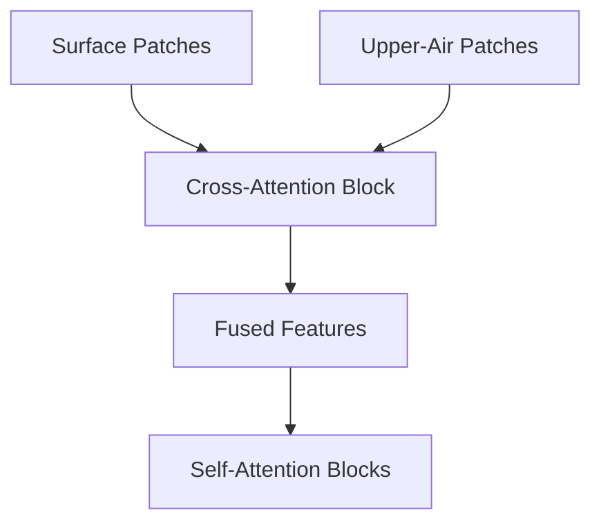
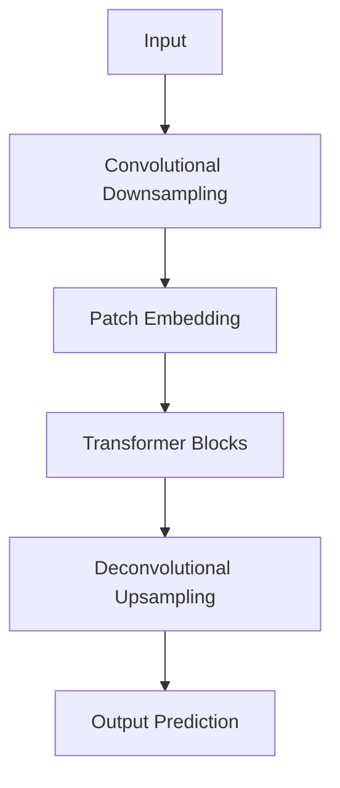
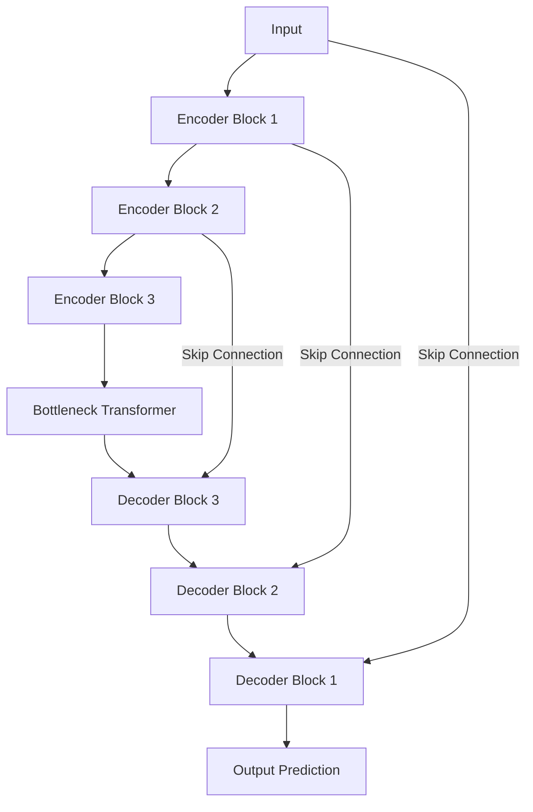

# Train14 Architecture

Train14 represents a series of exploratory architectural variants inspired by Pangu-Lite but customized for distributed High-Performance Computing workflows and novel attention mechanisms. This document outlines the core architectures implemented in this repository.

## 1. Base Train14 Architecture

The baseline Train14 models (`train14_era5.py`, `train14_gfs.py`, `train14_imdaa.py`) utilize an Earth-Specific Transformer layout, employing 3D Earth-Specific Positional Bias (3D-ESPB) and standard self-attention mechanisms over atmospheric states.

## 2. Data Pipeline

Train14 features a high-throughput, DDP-compatible data pipeline tailored for loading massive `netCDF4` / `grib` datasets efficiently across nodes without NFS congestion.

## 3. Distributed Training Workflow

## 4. Cross-Attention Workflow

The Cross-Attention variant (`train14_cross_attention.py`) modifies standard self-attention by explicitly fusing features from surface level observations with upper-air states using cross-attention modules.

## 5. Train14-Innovate Architecture

The `train14_innovate_era5.py` variant experiments with convolutional embeddings prior to patchification, allowing the model to capture local high-frequency details before applying global transformer-based attention.

## 6. TransFusion-UNet Architecture

The TransFusion-UNet variant (`train14_transfusion_unet.py`) combines the spatial hierarchy and skip connections of a U-Net with the global receptive field of Transformer layers.

